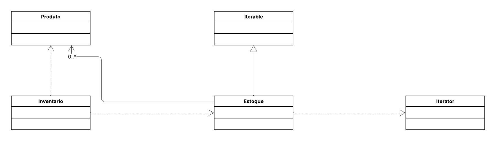

## 🛒 Sistema de Inventário e Contagem de Produtos

Este projeto implementa o padrão de projeto comportamental **Iterator**.
O objetivo é fornecer uma maneira de **acessar sequencialmente** os elementos de uma coleção (a classe `Estoque`) sem expor a sua representação interna (como ela armazena os `Produto`s). Dessa forma, o código cliente (a classe `Inventario`) pode percorrer a lista de produtos de forma uniforme e desacoplada da implementação do agregado.

-----

## 📌 Diagrama de Classes

-----

## 👩‍💻 Autora

**Eduarda Araujo Carvalho**
